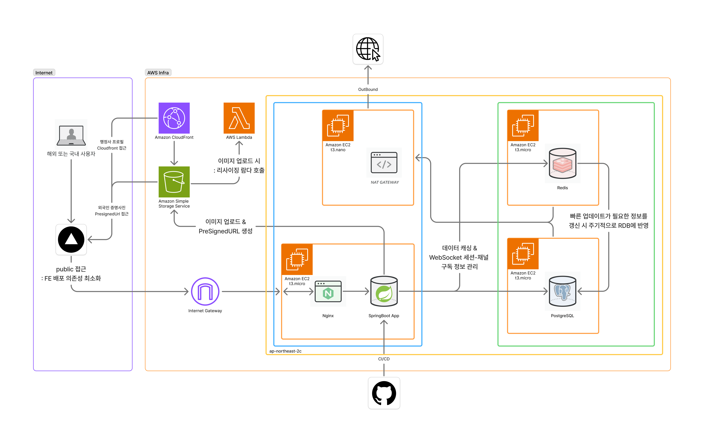

## Team6-Navisa
# 🛫 Navisa (내비자)
**"복잡한 비자 신청의 모든 과정을 스마트하게"
외국인과 전문 행정사를 잇는 맞춤형 매칭 플랫폼**

<br>


## 💬 기술 토론 (Discussion)
> **단순한 구현을 넘어 최적의 해결책을 찾기 위해 치열하게 고민한 흔적들입니다.**
> ### [👉 BE 개발 논의 과정 바로가기](https://github.com/softeerbootcamp-7th/WEB-Team6-Navisa/discussions)

<br>


## 📚 프로젝트 문서
> **Navisa의 모든 개발 기록과 기술적 고민은 위키에서 확인하실 수 있습니다.**
> ### [👉 Navisa 통합 Wiki 바로가기](https://github.com/softeerbootcamp-7th/WEB-Team6-Navisa/wiki)

<br>


## 📄 기술 문서 및 가이드라인
| 문서명 | 목적 및 주요 내용 | 바로가기 |
| :--- | :--- | :---: |
| **기술 표준 및 가이드라인** | 프로젝트 구조, 컨벤션, 공통 예외 처리 전략 | [🔗 이동](https://github.com/softeerbootcamp-7th/WEB-Team6-Navisa/wiki/BE-%EA%B8%B0%EC%88%A0-%ED%91%9C%EC%A4%80-%EB%B0%8F-%EA%B0%9C%EB%B0%9C-%EA%B0%80%EC%9D%B4%EB%93%9C%EB%9D%BC%EC%9D%B8) |
| **개발 논의 히스토리** | 주요 기술적 의사결정 및 이슈 해결 기록 | [🔗 이동](https://github.com/softeerbootcamp-7th/WEB-Team6-Navisa/wiki/BE-%EA%B0%9C%EB%B0%9C-%EB%85%BC%EC%9D%98-%ED%9E%88%EC%8A%A4%ED%86%A0%EB%A6%AC) |


<br>


## 📑 ERD 설계도
[🔗 Navisa ERD 바로가기](https://www.erdcloud.com/d/NiGGRPFFeqLzc8sLn)


<br>


## 🏗️ 인프라 아키텍처

[🔗 Navisa 아키텍처 다이어그램 바로가기](https://www.figma.com/board/QnPDChUIeMNIRU7r3rQUQq/Softeer_7th_Team6_Infra-Architecture?node-id=1-1938&t=enYOk9NQJc1qkh9t-1)



<br>

## 👨‍🏫 브랜치 전략

- **Git Flow**를 기반으로 하며, 효율적인 이슈 관리를 위해 브랜치명을 이슈 번호와 연동합니다.
- **브랜치 종류 및 명명 규칙**
    - `main` : 우리가 최종 개발 시 Merge 하는 곳
    - `develop` : 개발 중 merge하는 최상위 브랜치
    - `태그/#이슈번호-기능명` : 기능을 개발하면서 각자가 사용할 브랜치

      ex. `feat/#1-kakao-oauth`

    - `hotfix` : 급한 수정사항 및 QA를 반영할 때 사용할 브랜치

- **브랜치 흐름도**

    ```text
    // 분기 그래프
    main
    	ㄴ develop
    		ㄴ 태그/#이슈번호-기능명
    ```

    ```text
    // 브랜치 전략 예시
    main
    	ㄴ develop
    		ㄴfeat/#1-kakao-oauth // 이슈 브랜치
    		ㄴrefactor/#2-login // 이슈 브랜치
    ```

<br>

## 🤙🏻 커밋 컨벤션

[🔗 자세한 6캔두잇의 협업 프로세스 [Notion]](https://www.notion.so/bside/6-2ed22020273580d99f1ed4906ce86e85?source=copy_link)

- **Squash & Merge** 방식을 채택하여 개별 커밋에서는 이슈 번호를 생략하고, 변경 대상(BE/FE)을 명시하여 직관성을 높였습니다.
- 기본적으로 다음 커밋 메시지 규칙을 따릅니다.
- **형식: `태그(변경 대상) : 메시지`**

| **태그이름** | **내용** |
| --- | --- |
| `feat` | 새로운 기능 (파일 추가도 포함)을 추가할 경우 |
| `refactor` | 코드 수정, 프로덕션 코드 리팩토링 |
| `fix` | 버그를 고친 경우 |
| `!HOTFIX` | 급하게 치명적인 버그를 고쳐야하는 경우 |
| `style` | 코드 포맷 변경, 세미 콜론 누락, 코드 수정이 없는 경우 |
| `comment` | 필요한 주석 추가 및 변경 |
| `docs` | 문서를 수정한 경우 |
| `test` | 테스트 추가, 테스트 리팩토링(프로덕션 코드 변경 X) |
| `chore` | 빌드 테스트 업데이트, 패키지 매니저를 설정하는 경우(프로덕션 코드 변경 X) |
| `rename` | 파일 혹은 폴더명을 수정하거나 옮기는 작업만인 경우 |
| `remove` | 파일을 삭제하는 작업만 수행한 경우 |

```text
태그: 메시지

- 추가적인 설명들...

--------
// 설명

태그 : feat, chore 등등
메시지: 우리가 일반적으로 적는 내용
-----
// 예시

feat: 매칭 결과 API에 score 필드 추가
fix: 로그인 에러 메시지 표시 문제 수정
chore: cd 워크플로우 수정
```

