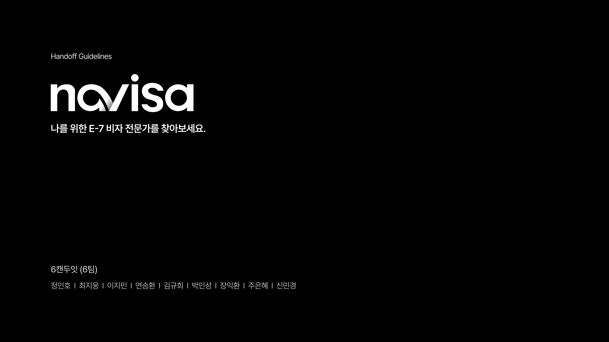
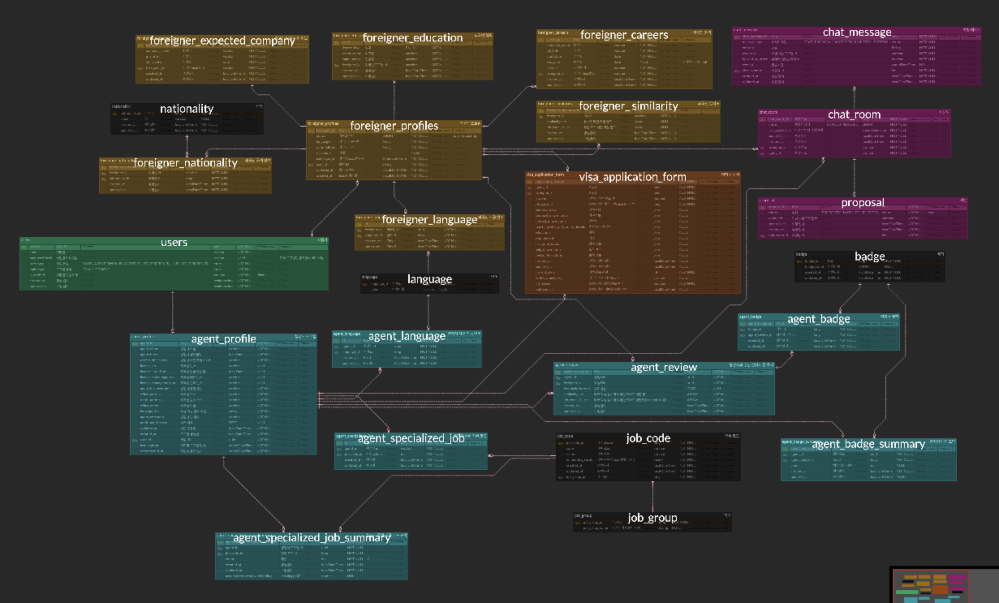
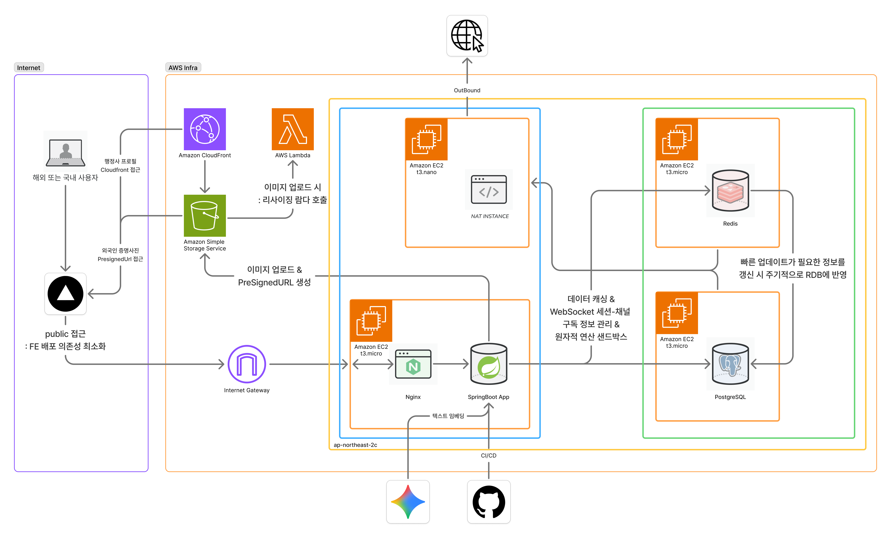

## Team6-Navisa
# 🛫 Navisa (내비자)

**"복잡한 비자 신청의 모든 과정을 스마트하게"
외국인과 전문 행정사를 잇는 맞춤형 매칭 플랫폼**

 

# ✨ 핵심 기능
## 1️⃣ 지능형 맞춤 행정사 추천
LLM을 활용한 데이터 기반 정교한 매칭

- 유사도 분석: 상용 LLM 임베딩을 통해 외국인의 입사 예정 직무와 행정사의 전문 분야 간의 유사도를 정밀하게 산출합니다.
- 자체 추천 로직: 산출된 유사도 점수에 행정사의 활동성 및 리뷰 평점을 결합한 자체 연산 로직을 적용하여 최적의 행정사 목록을 제공합니다.
  
   

  

   

  내비자는 단순 키워드 검색이 아닌, 6단계의 고도화된 연산 로직을 통해 추천 리스트를 생성합니다.
  
  - LLM 직무 임베딩: 외국인의 '입사 예정 직무'와 법무부 직종 코드(87종) 간의 유사도를 LLM으로 분석하여 상위 5개 직종을 선정합니다.
  - 활동성 기반 기초 점수: 행정사의 접속 빈도 및 재접속 확인 시점을 활용하여 매일 04시에 활동성 점수를 동적으로 산정합니다.
  - 전문 분야 가중치 분배: 행정사가 등록한 전문 분야 개수에 따라 Sigmoid 함수를 적용하여 공정한 점수 분배를 수행합니다.
  - 리뷰 가산점 알고리즘: 특정 분야의 리뷰 수뿐만 아니라, 리뷰를 남긴 의뢰인의 직종 유사도를 반영한 '실수형 가중 리뷰 수($z_a$)'를 산출하여 매칭의 신뢰도를 높입니다.
  - 최종 매칭 점수($G$) 산출: 유사도($w_i$)와 분배 점수($s_i$)를 결합한 최종 스코어링을 통해 개인화된 추천 목록을 제공합니다.
  
  $$G = \sum (w_i \times s_i)$$

## 2️⃣ 필터 기반 양방향 탐색
상세 조건을 통한 빠르고 정확한 타겟팅

- 상세 필터: 직군, 지역, 국적, 구사 언어 등 다양한 조건을 조합하여 자신에게 꼭 필요한 파트너를 찾을 수 있습니다.

- 외국인/행정사 모두 지원: 행정사는 한국 기업에 입사 예정인 외국인을, 외국인은 자신의 상황에 맞는 행정사를 신속하게 탐색할 수 있습니다.

   

  

   

## 3️⃣ 실시간 1:1 채팅 및 업무 관리
단순한 대화를 넘어선 의사결정 프로세스

- 워크플로우 통합: 채팅 내에서 수임 제안, 수락, 거절, 취소 등 단계별 상태 전환을 실시간으로 처리합니다.

- 실시간 알림: WebSocket 기반의 실시간 메시지 도착 알림으로 빠른 소통을 지원합니다.

   

  

   

## 4️⃣ 스마트 신청서 작성 및 PDF 생성
협업을 통한 서류 자동화 시스템

- 권한별 편집: 수임 전에는 외국인이, 수임 후에는 행정사가 문서 데이터를 편집할 수 있으며 자동 저장을 지원합니다.

- PDF 다운로드: 작성된 데이터를 실제 비자 신청서 양식(PDF)에 매핑하여 즉시 출력 가능한 형태로 제공합니다.

- 다국어 UI: 한국어, 영어, 중국어, 일본어 지원으로 언어 장벽을 최소화했습니다.

   

  

   

## 5️⃣ 신뢰 구축 시스템
지속 가능한 생태계를 위한 피드백 루프

- 데이터 선순환: 작성된 리뷰 점수를 추천 연산 로직에 다시 반영하여 매칭의 정밀도를 지속적으로 향상시킵니다.

- 사후 관리: 서류 다운로드 2주 후 자동 이메일 발송을 통해 수임 종료 여부를 확인하고 프로세스 상태를 업데이트합니다.

 

# 🎨 기획 및 디자인
> **사용자 경험을 최우선으로 생각하는 Navisa의 설계 기반입니다.**

* **📐 기획**

  * [🔗 기획 산출물 바로가기 (figma)](https://www.figma.com/design/bO3fqDgEZfQ3oCGJTHlM5d/Navisa-Handoff?node-id=4002-56975&t=8YyjgisB0pJL51Zg-1)

* **✨ 디자인**

  * [🔗 디자인 산출물 바로가기 (figma)](https://www.figma.com/design/bO3fqDgEZfQ3oCGJTHlM5d/Navisa-Handoff?node-id=170-53&t=8YyjgisB0pJL51Zg-1)

  
 

# 🛠️ 기술적 도전 및 해결

> **Navisa팀은 단순한 기능 구현을 넘어, 데이터의 신뢰성과 시스템의 안정성을 확보하기 위해 끊임없이 고민했습니다.**
> 
> 자세한 내용은 팀 WIKI에서 확인하실 수 있습니다.

### 1. 고도화된 매칭 엔진 설계
단순 매칭의 한계를 극복하기 위해 **다단계 가중치 연산 알고리즘**을 자체 설계했습니다.

* **LLM 직무 임베딩**: `gemini-embedding-001` 모델을 활용하여 외국인의 자유 형식 직무 텍스트를 벡터화하고, 법무부 표준 직종 코드와 코사인 유사도를 분석해 매칭 정확도를 높였습니다.
* **동적 가중치 시스템**: 행정사의 활동성(최근 접속), 전문 분야의 희소성(Sigmoid 함수 적용), 그리고 리뷰의 질적 가치($z_a$)를 결합하여 매칭 신뢰도를 수치화했습니다.

### 2. 안정적인 실시간 통신 및 동시성 제어
* **WebSocket & Redis**: 분산 서버 환경에서 실시간 채팅의 메시지 유실을 방지하기 위해 Redis를 활용한 메시지 브로커를 구축했습니다.
* **스케줄러 중복 실행 방지**: `ShedLock`을 도입하여 다중 인스턴스 환경에서 행정사 활동 점수 업데이트 및 이메일 발송 배치가 중복 실행되지 않도록 보장했습니다.
* **부하 테스트 및 최적화**: 채팅 서비스의 병목 현상을 해결하기 위해 부하 테스트를 진행하고 연결 유지 전략을 최적화했습니다.

### 3. 복잡한 Form 데이터 및 문서 자동화
* **JSON 스키마 기반 설계**: 방대한 비자 신청 서류의 UI를 유연하게 관리하기 위해 JSON 스키마 기반의 Form 아키텍처를 설계했습니다.
* **Client-Side PDF 매핑**: 서버 부하를 줄이고 보안을 강화하기 위해 `pdf-lib`을 사용하여 브라우저 환경에서 직접 데이터를 PDF 템플릿에 매핑하고 다운로드하는 기능을 구현했습니다.
* **대규모 상태 관리**: `react-hook-form`을 사용하여 수십 개의 입력 필드에 대한 유효성 검사 및 자동 저장 기능을 최적화했습니다.

### 4. 인프라 및 운영 안정성
* **이미지 전송 최적화**: `CloudFront + S3 + Lambda` 조합을 통해 전 세계 어디서든 빠른 이미지 로딩 속도를 확보했습니다.
* **테스트 인프라 개선**: 컨테이너 재사용 전략을 통해 통합 테스트 시간을 단축하고 개발 생산성을 향상시켰습니다.
* **장애 대응 전략**: Gemini API 등 외부 의존성 서비스의 장애나 Quota 초과 상황에 대비한 예외 처리 및 Fallback 전략을 수립했습니다.

### 5. 외부 의존성 장애 대응 및 데이터 정합성 확보
Gemini API 장애나 Quota 초과 시에도 서비스가 멈추지 않도록 3단계 방어 체계를 구축했습니다.

* **서킷 브레이킹**: 외부 API 지연이 발생하면 즉시 연결을 차단하여 서버 자원 고갈을 방지합니다.
* **비동기 재시도**: 호출 실패 시 데이터를 Redis에 임시 저장하고 회원가입은 정상 처리하여 사용자 이탈을 막습니다.
* **데이터 안정성 확보**: ACK 메커니즘을 통해 장애 상황에서도 메시지 유실 없는 정합성을 보장합니다.

 

# 📑 ERD 설계도
[🔗 Navisa ERD 바로가기](https://www.erdcloud.com/d/NiGGRPFFeqLzc8sLn)

 

# 🏗️ 인프라 아키텍처

[🔗 Navisa 아키텍처 다이어그램 바로가기](https://www.figma.com/board/QnPDChUIeMNIRU7r3rQUQq/Softeer_7th_Team6_Infra-Architecture?node-id=1-1938&t=enYOk9NQJc1qkh9t-1)

 

## 📚 프로젝트 문서

> **Navisa의 모든 개발 기록과 기술적 고민은 위키에서 확인하실 수 있습니다.**
> ### [👉 Navisa 통합 Wiki 바로가기](https://github.com/softeerbootcamp-7th/WEB-Team6-Navisa/wiki)

 

## 📌 파트별 바로가기
> **각 파트별 상세 구현 사항 및 기술 스택은 아래 리드미에서 확인하실 수 있습니다.**

| 파트 | 바로가기 링크 |
| :--- | :--- |
| **Frontend** | [🎨 FE 상세 README 바로가기](https://github.com/softeerbootcamp-7th/WEB-Team6-Navisa/tree/develop/FE) |
| **Backend** | [⚙️ BE 상세 README 바로가기](https://github.com/softeerbootcamp-7th/WEB-Team6-Navisa/tree/develop/BE) |

 

## 📚 프로젝트 자원

| Category           | Resources |
|:-------------------| :--- |
| **데일리 노트**         |  |
| **기획 및 디자인 산출물**   |   |
| **ERD 및 인프라 아키텍처** |   |
| **백로그**            |  | 

 

# 👨‍👧‍👦 팀 소개: 6캔두잇
언어의 장벽과 복잡한 행정 절차 때문에 어려움을 겪는 외국인들이 한국에 안정적으로 정착할 수 있도록,  
IT 기술로 그 길을 밝히는 내비게이터 역할을 하고자 합니다.

효율적인 문서 자동화와 신뢰 기반의 행정사 매칭을 통해 비자 신청의 패러다임을 바꿉니다.

    <table align="center">
        <tr>
            <th><a href="https://github.com/Stamp-Ho">정인호</a></th>
            <th><a href="https://github.com/roony1225">연승환</a></th>
            <th><a href="https://github.com/Hexeong">박인성</a></th>
            <th><a href="https://github.com/shinminkyoung1">신민경</a></th>
            <th><a href="https://github.com/JangIkhwan">장익환</a></th>
        </tr>
        <tr>
            <td></td>
            <td></td>
            <td></td>
            <td></td>
            <td></td>
        </tr>
        <tr>
            <td align="center">FE</td>
            <td align="center">FE</td>
            <td align="center">BE</td>
            <td align="center">BE</td>
            <td align="center">BE</td>
        </tr>
    </table>

 

  <b>"낯선 땅에서의 시작이 두려움이 아닌 설렘이 되도록, Navisa가 든든한 내비게이터가 되겠습니다."</b>

 